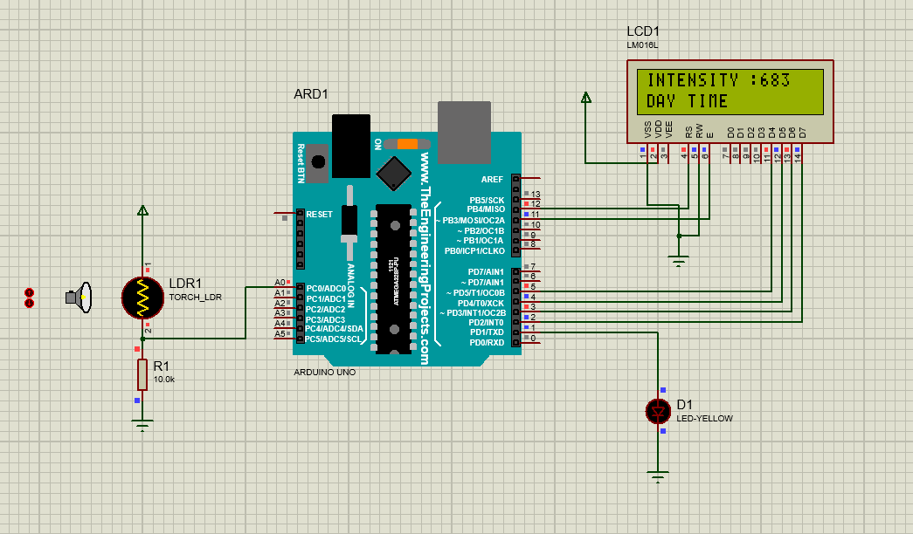
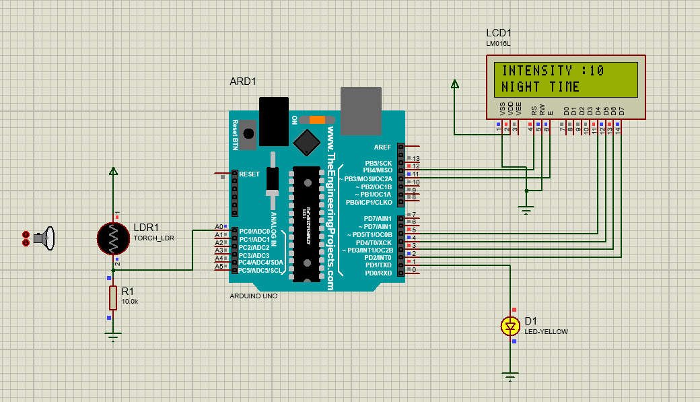

# **Smart Light**

## **About**
**"Smart Light"** is a prototype model for smart street lights. The street light will automatically be set OFF if the intensity of light is more than **(Day time)** the set threshold value and will be set ON if the intensity of light is less than **(Night time)** the set threshold value, thus saving electricity.

## **Circuit Diagram**

|Day Time|Night Time|
|-----|-----|
|||

## **Demo**

